<div align="center">

# SpaceRed

A full-stack NBA analytics platform featuring advanced stats, a CBA-accurate trade and salary-cap engine, draft-capital valuation, and predictive models. Built around the Houston Rockets and the entire league.


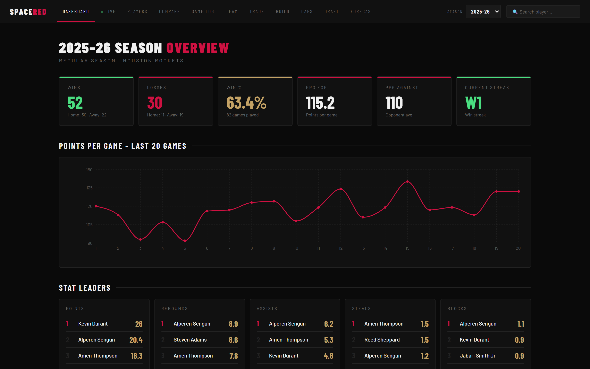

</div>

---

## Overview

SpaceRed began as a single-team stats site and grew into a league-wide front-office analytics platform. It combines live NBA data with custom models that mirror real basketball decision-making: what a player is worth in a trade, whether a deal is legal under the salary cap, how a team can get under the luxury-tax aprons, which draft picks a team actually controls, and who is favored in a given matchup.

**Highlights**

- League-wide data for all 30 teams across two seasons, switchable from the navbar.
- A trade engine that enforces real NBA Collective Bargaining Agreement salary-matching and apron rules.
- A salary-cap system driven by scraped contract data, with automated cap-relief recommendations.
- Exact draft-pick ownership for every team, including swaps, protections, and computed pick numbers.
- Predictive models for game outcomes and betting value.

---

## Features

### Dashboard
Season overview at a glance: record, scoring trend, statistical leaders, and recent results.


### Players and Profiles
A full roster browser with a 2K-style overall rating for each player, plus deep individual profiles featuring league-ranked averages, advanced metrics (Offensive and Defensive Rating, True Shooting, eFG%, Usage, PIE), a shot chart, game-by-game trends, and a skill radar.

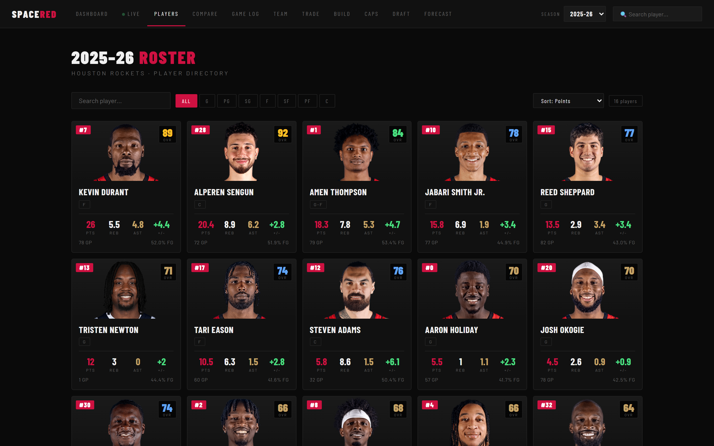
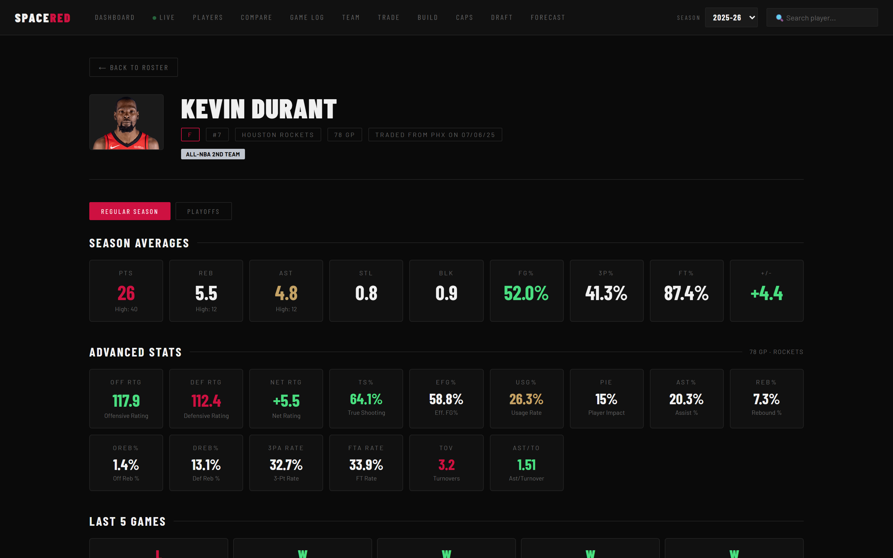

### Compare
Side-by-side comparison of any two players in the league across core and advanced statistics.

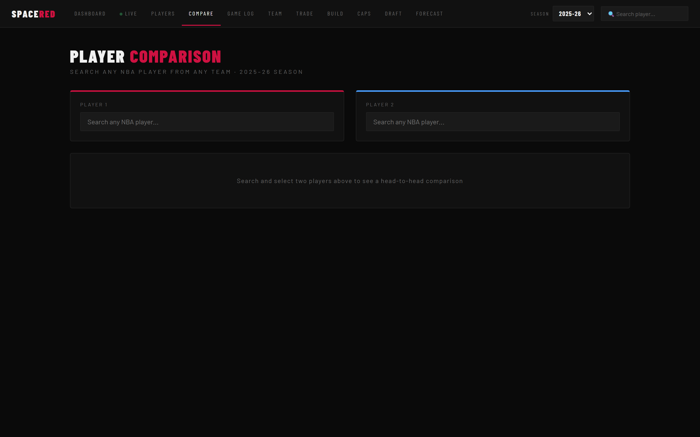

### Team Hub
Shooting splits and zone breakdowns, most-used lineups, and clutch-time performance, grouped into a single team-analytics hub.

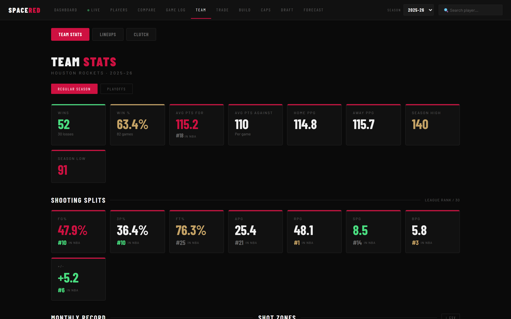

### Trade Machine
A cap-legal trade builder. Pick players from any two teams and instantly see salary in and out, value balance, and whether the deal is legal under the team's cap, tax, and apron situation, enforcing the simplified 2023 CBA salary-matching rules.

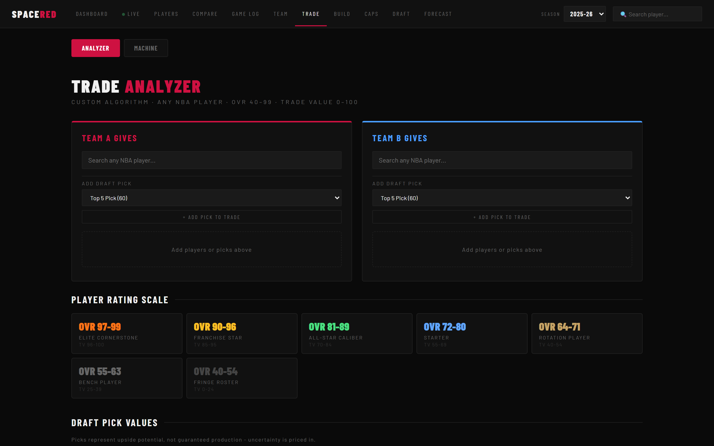

### Championship Builder
A recommendation engine that proposes value-matched, salary-legal trades tailored to a team's roster needs, and shows how each deal moves both teams across the cap, tax, and apron lines.

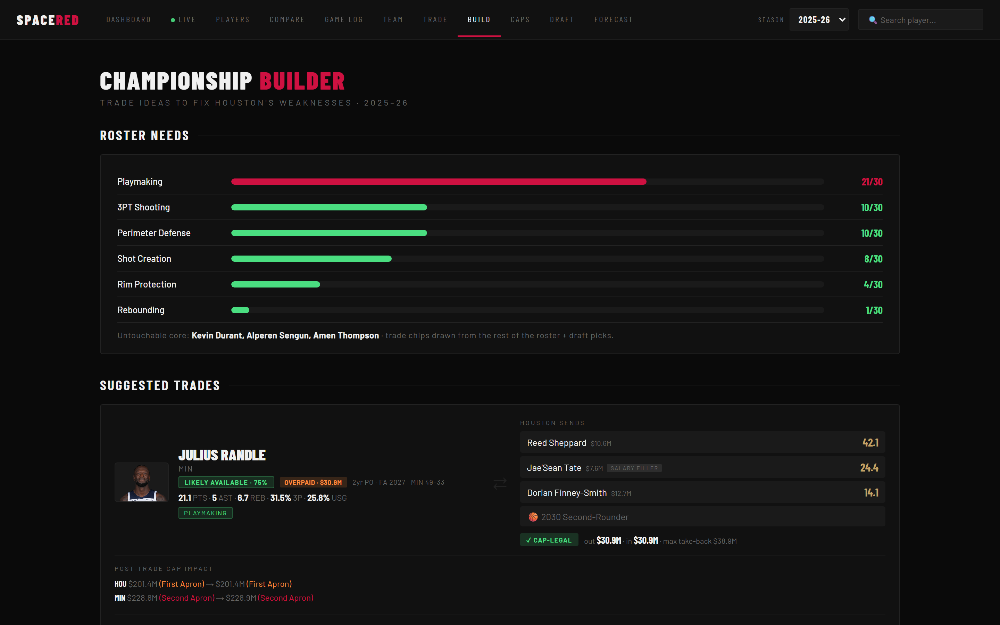

### Salary Cap and Contracts
Every team's cap sheet built from scraped contract data, with current-season and forward-looking outlook. For teams over the aprons, an automated relief plan recommends the most likely cost-cutting moves, protecting stars and young building blocks, and separating realistic trades from minor waivable contracts.

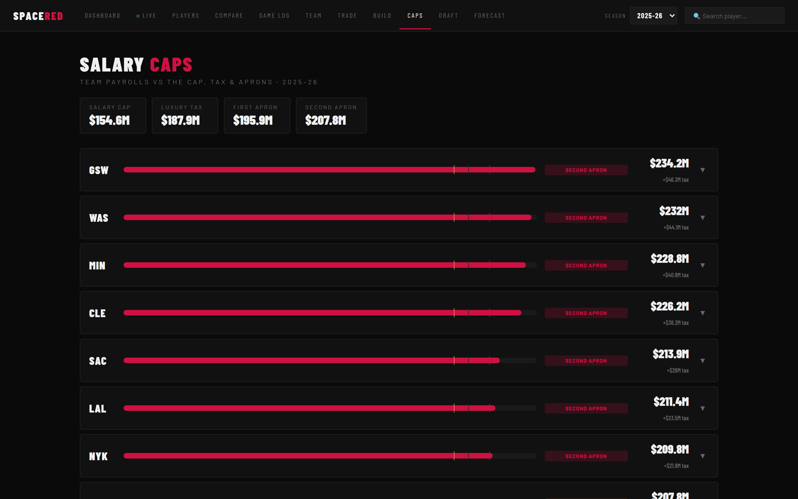

### Draft Capital
Exact draft-pick ownership for all 30 teams (incoming, outgoing, swaps, and protections), scraped to stay current, with real pick numbers computed from the standings for the next confirmed draft.

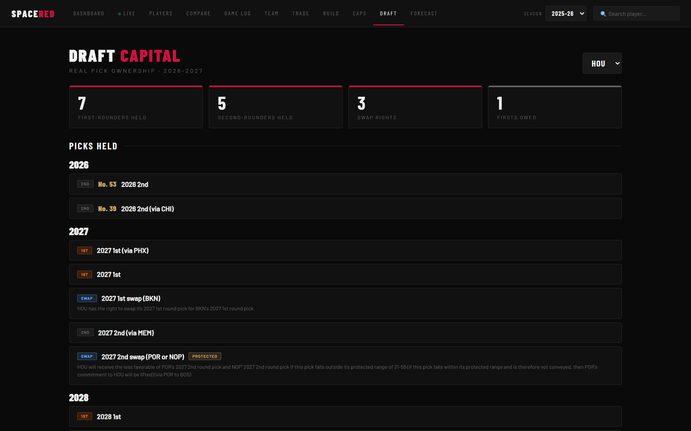

### Forecast
An Elo-based game predictor and a betting-edge finder that de-vigs the odds and surfaces positive expected-value opportunities.

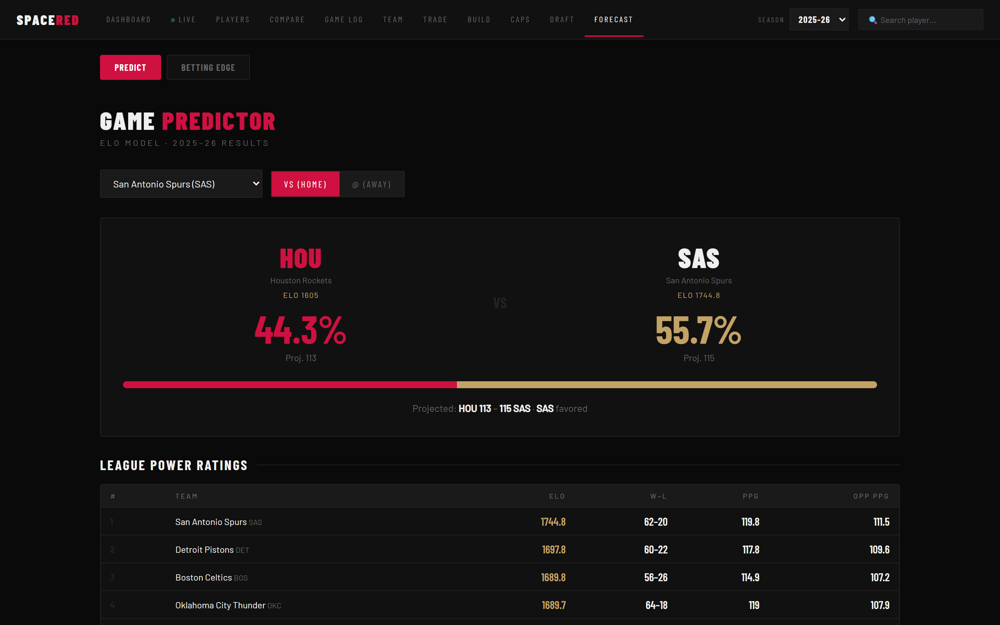

### Live Scores
A real-time league scoreboard for the current slate of games.

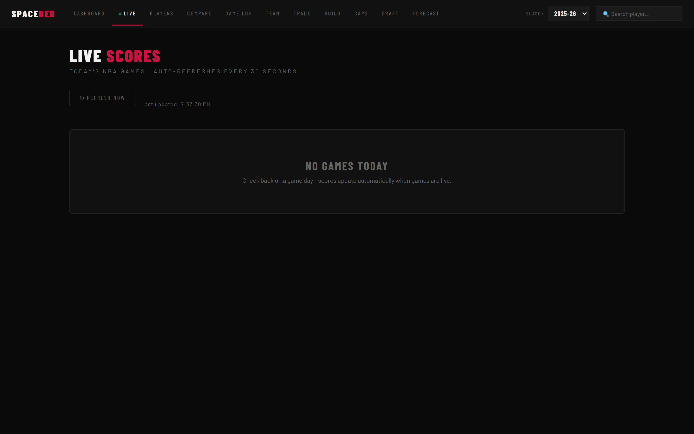

---

## Tech Stack

| Layer | Technology |
|---|---|
| Backend | Python 3.13, FastAPI, psycopg2 |
| Database | PostgreSQL |
| Data sources | nba_api (NBA Stats API); custom scrapers for contracts and draft picks |
| Frontend | React 19, React Router v7, Recharts, Axios |
| Modeling | Elo ratings, CBA salary-matching, expected-value and Kelly betting math, draft-pick valuation |

The contract and draft-pick scrapers are written with the Python standard library only (no third-party HTML parser), and bypass bot protection with realistic browser headers. Player headshots are proxied through the backend because the NBA CDN blocks cross-origin browser requests.

---

## Architecture

```
spacered/
├── backend/
│   ├── main.py             FastAPI app: all API endpoints
│   ├── scraper.py          NBA data pipeline that populates PostgreSQL
│   ├── trade_ideas.py      Trade value model and Championship Builder engine
│   ├── contracts.py        Salary-cap engine, CBA matching, cap-relief planner
│   ├── recognition.py      Player recognition tiers and accent-safe name matching
│   ├── draft.py            Draft-pick ownership, valuation, and pick numbers
│   ├── spotrac_scraper.py  Contract and cap scraper
│   ├── draft_scraper.py    Draft-pick scraper (all 30 teams)
│   └── .env.example        Environment variable template
├── frontend/
│   └── src/
│       ├── App.js          Routing and navigation
│       ├── pages/          One module per page (Dashboard, Players, Caps, and more)
│       └── components/     Shared UI (hubs, charts, cards)
├── docs/
│   └── screenshots/        Images used in this README
└── README.md
```

---

## Setup

### Prerequisites

- Python 3.10+
- Node.js 18+
- PostgreSQL 14+

### 1. Database

```sql
CREATE DATABASE rockets_db;
```

### 2. Backend

```bash
cd backend
python -m venv venv
# Windows: venv\Scripts\activate    macOS/Linux: source venv/bin/activate
pip install fastapi uvicorn psycopg2-binary python-dotenv nba_api pandas
```

Copy the environment template and fill in your database credentials:

```bash
cp .env.example .env
```

```
DB_HOST=localhost
DB_PORT=5432
DB_NAME=rockets_db
DB_USER=postgres
DB_PASSWORD=your_password_here
```

Populate the database (takes around ten minutes; the NBA Stats API is rate-limited, so the pipeline paces its requests):

```bash
python scraper.py
```

Start the API:

```bash
uvicorn main:app --reload
```

The API runs at `http://127.0.0.1:8000`, with interactive docs at `/docs`.

### 3. Frontend

```bash
cd frontend
npm install
npm start
```

The app runs at `http://localhost:3000`.

### 4. Data refresh (optional)

The contract and draft-pick snapshots are committed to the repo, so the app works out of the box. To refresh them:

```bash
cd backend
# Windows: set PYTHONUTF8=1 first
python spotrac_scraper.py 2025 2026
python draft_scraper.py
```

---

## API Reference

<details>
<summary>Expand full endpoint list</summary>

| Method | Path | Description |
|---|---|---|
| GET | `/seasons` | Available seasons |
| GET | `/players` | Roster with season averages |
| GET | `/players/overalls` | 2K-style overall ratings (fast, DB-only) |
| GET | `/players/{id}` | Player detail and full game log |
| GET | `/players/{id}/advanced` | Off/Def Rating, TS%, eFG%, Usage, PIE, rankings |
| GET | `/headshot/{id}` | Proxied NBA player headshot |
| GET | `/games` | Team game log |
| GET | `/games/{id}` | Box score |
| GET | `/season/summary` | Record and scoring averages |
| GET | `/stats/leaders` | Statistical leaders |
| GET | `/team/stats` | Shooting splits, zones, monthly record |
| GET | `/team/rankings` | League-wide team rankings |
| GET | `/team/clutch` | Clutch-time performance |
| GET | `/team/lineups` | Most-used lineups by size |
| GET | `/shots/{player_id}` | Shot chart data |
| GET | `/predict` | Elo-based game prediction vs. an opponent |
| GET | `/betting/edges` | Positive expected-value betting opportunities |
| GET | `/betting/evaluate` | Evaluate a specific line |
| GET | `/trade/value/{id}` | Trade value (0-100) and overall (40-99) for any player |
| GET | `/trade/ideas` | Championship Builder trade recommendations |
| GET | `/trade/rosters` | Rosters, salaries, and tradeable picks for the Trade Machine |
| POST | `/trade/evaluate` | Evaluate a custom multi-team trade for legality and balance |
| GET | `/contracts/cap` | League cap sheet |
| GET | `/contracts/team/{team}` | Team contracts and cap-relief plan |
| GET | `/draft/picks` | Pick ownership for a given team |
| GET | `/draft/assets` | League draft-asset summary |
| GET | `/nba/search` | Search any NBA player by name |
| GET | `/nba/player/{id}/stats` | Live stats for any NBA player |
| GET | `/live/scores` | Today's NBA scoreboard |

</details>

---

## Notes

- Core NBA data is fetched through the public `nba_api` library; no API key is required.
- Contract and salary data are scraped and snapshotted to JSON, then merged into the cap engine.
- Roster membership for trade and cap-relief logic is sourced from live NBA data, so waived or dead-money contracts are never mistaken for active players.
- Advanced stats load live on each player profile, so the first view of a player may take a couple of seconds.
